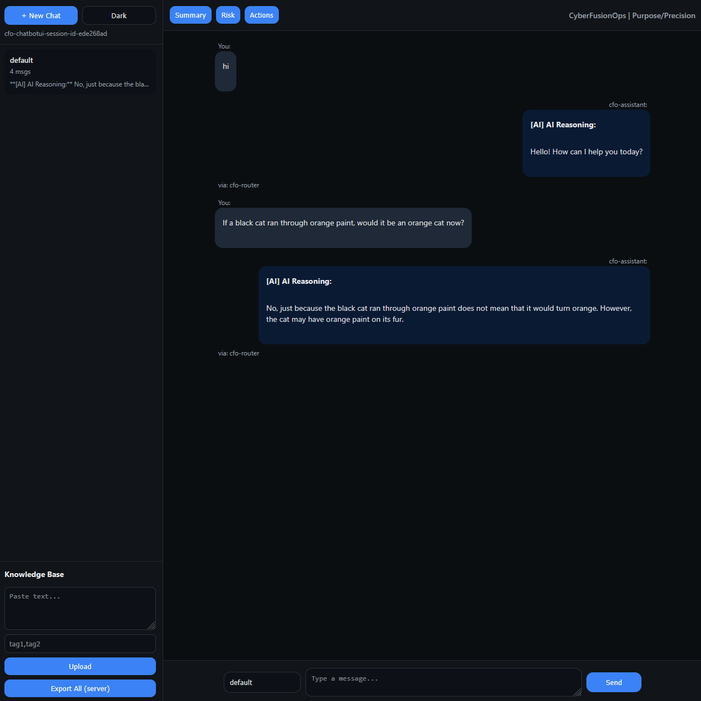
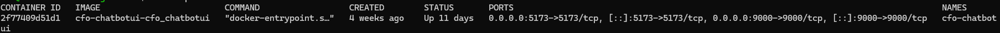
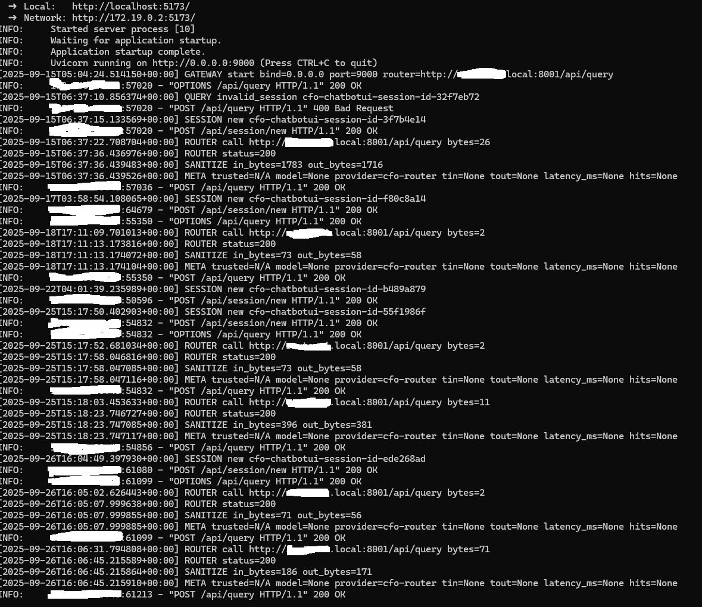

# CFO ChatbotUI

A **full-stack demo chatbot application** built with a React/TypeScript frontend and a FastAPI backend.  
This project demonstrates how to integrate a user-facing interface with an AI orchestration layer, including:  

- Chat history management  
- Admin knowledge base upload  
- Auditable logs for compliance-focused environments  

---

## 🔹 Tech Stack
- **Frontend**: React, TypeScript  
- **Backend**: FastAPI (Python)  
- **Orchestration**: API routing + retrieval-augmented responses  
- **Deployment**: Dockerized for local and portable setups  

---

## 🔹 Architecture

```mermaid
flowchart LR
    A[User Browser] -->|HTTPS| B[HAProxy Reverse Proxy]
    B -->|Forward requests| C["CFO ChatbotUI (Frontend - Port 5173)"]
    B -->|Internal route| D["Backend API (FastAPI - Port 9000)"]
    C -->|API calls| B
    D -->|Responses| B
````

**Explanation:**
The UI is exposed securely through HAProxy via HTTPS.
All API traffic is routed internally to the backend service, which is never directly exposed to the internet.
This ensures a **defense-in-depth** architecture where only the frontend is public-facing.

---

## 🔹 Features

* Chat-based user interface with message persistence
* Admin panel for uploading and managing knowledge base content
* Logging system for auditability and review

---

## 🔹 Demo

Below are screenshots showing the application in action:

* Chat UI responding to user input
* Docker container running (frontend + backend)
* Backend logs processing API calls





---

## 🔹 Disclaimer

⚠️ This repository is a **demo version**.
It excludes production implementations, private configurations, and sensitive integrations.
Full versions are maintained in a private environment.

---

## 🔹 Notes

This project is part of **Project Fong** — building AI systems with enterprise discipline and compliance awareness.

---

## 🔹 License

This project is released under **All Rights Reserved**.
See the [LICENSE](LICENSE.md) file for details.

